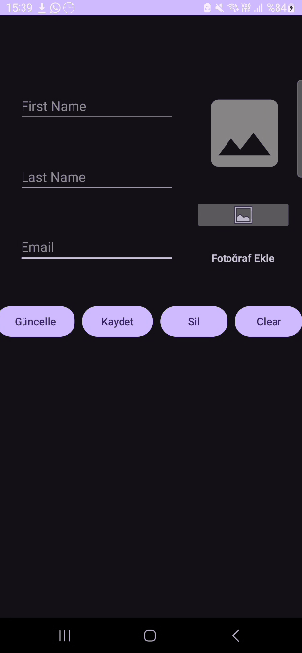
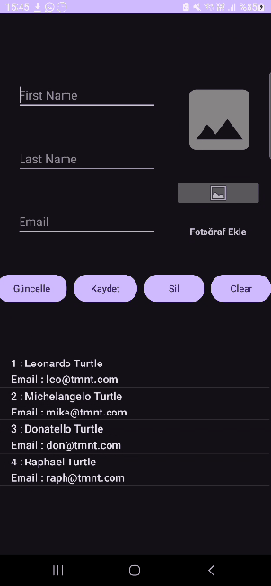
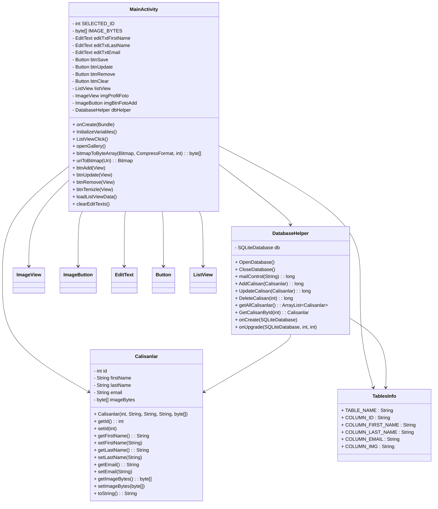

# :rocket: SQLite Kullanımı

## :bulb: Proje Hakkında

Bu proje, Android üzerinde SQLite kullanarak veritabanı işlem örneklerini içeren bir uygulamadır.
Proje kapsamında *Calisanlar* üzerinden CRUD işlemleri yapılmaktadır.

Uygulama ile kullanıcılar :

- Çalışan ekleyebilir,
- Güncelleyebilir,
- Listeden silebilir,
- Çalışan bilgilerini listeleyebilir,
- Çalışan profili için fotoğraf ekleyebilir ve görüntüleyebilir.

> NOT : Çok yüksek çözünürlüklü fotoğraflarlar bazı cihazlarda görüntülenmeyebilir.

## Uygulama Özellikleri

| Özellik | Açıklama |
| - | - |
| **Veritabanı** | SQLite kullanılarak lokal veritabanı oluşturulur ve yönetilir. |
| **CRUD İşlemleri**   | Çalışan ekleme, güncelleme, silme ve listeleme yapılabilir.                           |
| **Fotoğraf Desteği** | Galeriden fotoğraf seçip profil resmi olarak kaydetme.                                |
| **ListView**         | Çalışanlar listede gösterilir ve seçilen çalışan bilgileri EditText alanlarına gelir. |
| **Email Kontrolü**   | Email benzersiz olmalıdır, aynı email ile çalışan eklenemez.                          |

## Uygulama Kullanımı

- Çalışan Ekleme
	- Ad, soyad ve email girin.
	- İsteğe bağlı olarak profil fotoğrafı ekleyin.
	- "Kaydet" butonuna basın.

- Çalışan Güncelleme
	- Listeden bir çalışan seçin.
	- Bilgileri değiştirin veya yeni fotoğraf ekleyin.
	- "Güncelle" butonuna basın.

- Çalışan Silme
	- Listeden bir çalışan seçin.
	- "Sil" butonuna basın.

- Temizle
	- Girdi alanlarını temizlemek için "Temizle" butonuna basın.

## Uygulama Örnekleri

| Çalışan Ekleme | Çalışan Listeleme |
| :-: | :-: |
|  |   |

## UML Diagram

## Bilinen Sınırlamalar

- Uygulama çok yüksek çözünürlüklü fotoğrafları (örn. 3000x4000 px) düzgün gösteremeyebilir.
- Bu durum, Android Bitmap bellek sınırlamaları ve ListView ile görüntüleme nedeniyle oluşur.
- Öneri: Fotoğrafları önceden optimize ederek uygulamaya ekleyin. Ya da yüksek kalitede fotoğraf eklemeye çalışmayın.

## Notlar

- Email alanı benzersiz olmalıdır; aynı email ile çalışan eklenemez.
- Profil fotoğrafı opsiyoneldir; eklenmezse varsayılan görsel gösterilir.
- SQLite veritabanı uygulama içinde lokal olarak tutulur ve sadece bu uygulama tarafından erişilebilir.